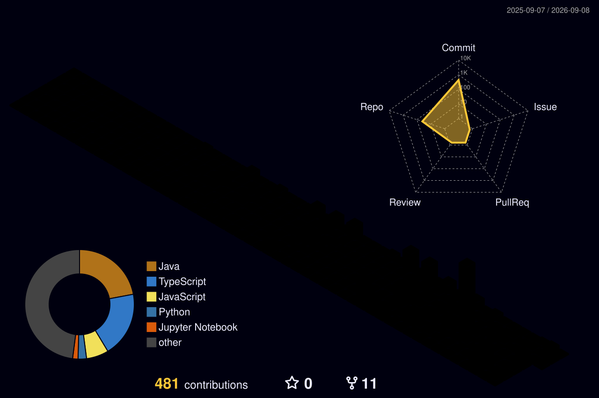

<center>
  
</center>

<table border="0">
  <tr>
    <td width="32%" valign="top">
      
    </td>
    <td width="68%" valign="top">
      ➤ 🤖 AI & Data Science student who enjoys building practical solutions through real-world projects.<br>
      ➤ 💻 Worked on **AI-powered applications, RAG systems, full-stack web projects, and workflow automation**.<br>
       🚀 Interested in **Web Development, Full-Stack Development, AI, and AI Automation**.<br>
      ➤ 🛠️ I enjoy turning ideas into working products and solving real-world problems through technology.<br>
      ➤  Currently focused on improving my skills, building meaningful projects, and growing as a **Software Developer**.<br>
    </td>
  </tr>
</table>

<br>

<div align="center">
  <b>🌐 Connect With Me</b><br><br>
  <a href="https://www.instagram.com/hariprasath_dlh">
    
  </a>
  &nbsp;
  <a href="https://www.linkedin.com/in/hariprasath-lv/">
    
  </a>
  &nbsp;
  <a href="https://hariprasath-dlh.github.io/hariprasath-portfolio/">
    
  </a>
  &nbsp;
  <a href="mailto:hariprasathdlhdlh@gmail.com">
    
  </a>
</div>

<h2 align="center">🧰 <strong>SKILLS</strong></h2>

<table align="center" border="0">
  <tr>
    <td align="center">
      
    </td>
    <td align="center">
      
    </td>
    <td align="center">
      
    </td>
    <td align="center">
      
    </td>
    <td align="center">
      
    </td>
  </tr>

  <tr>
    <td align="center">
      
    </td>
    <td align="center">
      
    </td>
    <td align="center">
      
    </td>
    <td align="center">
      
    </td>
    <td align="center">
      
    </td>
    <td align="center">
      
    </td>
  </tr>

  <tr>
    <td align="center">
      
    </td>
    <td align="center">
      
    </td>
    <td align="center">
      
    </td>
    <td align="center">
      
    </td>
  </tr>

  <tr>
    <td align="center">
      
    </td>
    <td align="center">
      
    </td>
    <td align="center">
      
    </td>
  </tr>
</table>
##  TOP PROJECTS

<details>
  <summary><strong>🤖 RootMind — Autonomous Multi-Agent AIOps Platform</strong></summary>
  
  ➤ <strong>What:</strong> An autonomous AIOps platform for detecting anomalies, investigating root causes, and assisting with incident remediation.<br>
  ➤ <strong>Problem Solved:</strong> Reduces manual effort in system monitoring, debugging, root-cause analysis, and incident response.<br>
  ➤ <strong>Architecture:</strong> Multi-agent workflow using LangGraph with anomaly detection, RAG-based investigation, code patch suggestions, and automated post-mortems.<br>
   <strong>AI Stack:</strong> LangGraph, Isolation Forest, Qdrant, Groq Llama 3, RAG, GitHub API, and Slack integration.<br>
  ➤ <strong>Metrics:</strong> Anomaly detection precision, RCA accuracy, retrieval relevance, remediation success rate, and MTTR reduction.<br>
  ➤ <strong>Key Feature:</strong> Connects monitoring → root-cause analysis → patch suggestion → developer notification → post-mortem generation.<br>
</details>

<details>
  <summary><strong> Intellexa AI — AI-Powered Intelligent Application</strong></summary>
  
   <strong>What:</strong> An AI-powered application designed to process user inputs and generate useful, context-aware results.<br>
  ➤ <strong>Problem Solved:</strong> Simplifies information processing by combining AI capabilities with an application-focused user experience.<br>
  ➤ <strong>Architecture:</strong> User interaction → prompt processing → AI inference → structured response generation.<br>
  ➤ <strong>AI Stack:</strong> Python, LLMs, Prompt Engineering, RAG concepts, REST APIs, and modern web technologies.<br>
  ➤ <strong>Metrics:</strong> Response accuracy, relevance, latency, token efficiency, task completion rate, and user satisfaction.<br>
  ➤ <strong>Key Feature:</strong> Converts natural-language requests into practical and structured results through an AI-driven workflow.<br>
</details>

<details>
  <summary><strong>📚 DocuSphere — Retrieval-Augmented Document Intelligence</strong></summary>
  
  ➤ <strong>What:</strong> A RAG-based document Q&A system for retrieving information and answering questions from uploaded documents.<br>
  ➤ <strong>Problem Solved:</strong> Helps users find relevant information from documents without manually searching through large files.<br>
  ➤ <strong>Architecture:</strong> Document processing → chunking → embeddings → vector retrieval → context generation → grounded response.<br>
  ➤ <strong>AI Stack:</strong> Python, FastAPI, FAISS, SentenceTransformers, RAG, React, and TypeScript.<br>
  ➤ <strong>Metrics:</strong> Retrieval Precision@K, Recall@K, answer relevance, grounding accuracy, response latency, and hallucination rate.<br>
  ➤ <strong>Key Feature:</strong> Combines semantic search and context-aware generation to provide answers grounded in the uploaded documents.<br>
</details>

<details>
  <summary><strong>⚙️ RepoCraft — Developer-Focused Automation Platform</strong></summary>
  
  ➤ <strong>What:</strong> A developer-focused project designed to simplify and automate repository-related development workflows.<br>
  ➤ <strong>Problem Solved:</strong> Reduces repetitive repository management and development tasks through automation.<br>
  ➤ <strong>Architecture:</strong> <strong>[Add your actual RepoCraft architecture here]</strong>.<br>
  ➤ <strong>Tech Stack:</strong> <strong>[Add the actual RepoCraft technologies here]</strong>.<br>
  ➤ <strong>Metrics:</strong> <strong>[Add measured metrics such as automation time saved, task success rate, or processing latency]</strong>.<br>
  ➤ <strong>Key Feature:</strong> <strong>[Add RepoCraft's main differentiating feature here]</strong>.<br>
</details>

##  GitHub Contributions



---

### ✍️Quote
```
"சிந்தனை கனவாக மாறும்           "Thought becomes a dream
கனவு செயலாக மாறும்                Dreams become action
செயல் வெற்றியாக மாறும்."           Action becomes success."
```


